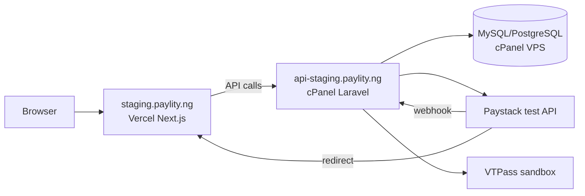

# Hybrid Staging Deployment — PAYLITY NG

**Ticket:** PAY-017 · **Release:** 1.0.0-rc1

This is the **official staging deployment path** for PAYLITY NG:

| Layer | Platform | URL |
|-------|----------|-----|
| Frontend (Next.js) | **Vercel** | `https://staging.paylity.ng` |
| API (Laravel) | **cPanel VPS** | `https://api-staging.paylity.ng` |
| Database | **cPanel VPS** (MySQL or PostgreSQL) | localhost on VPS |
| DNS / SSL (API subdomain) | **cPanel** | AutoSSL or Let’s Encrypt |
| DNS (frontend subdomain) | **cPanel → Vercel CNAME** | SSL on Vercel |

No application logic changes are required for this layout.

---

## Architecture



**Traffic flow**

1. Customer uses `staging.paylity.ng` (Vercel).
2. Next.js calls `https://api-staging.paylity.ng/api/v1/*`.
3. Paystack redirects to `https://staging.paylity.ng/payment/callback`.
4. Paystack webhooks hit `https://api-staging.paylity.ng/api/v1/payments/paystack/webhook`.
5. Ops console at `https://staging.paylity.ng/ops` uses the same API with operator key.

---

## Step-by-step overview

| Step | Doc | Summary |
|------|-----|---------|
| 1 | This doc + cPanel Zone Editor | DNS records |
| 2 | [CPANEL-LARAVEL-API-DEPLOYMENT.md](./CPANEL-LARAVEL-API-DEPLOYMENT.md) | Laravel on VPS |
| 3 | [VERCEL-FRONTEND-DEPLOYMENT.md](./VERCEL-FRONTEND-DEPLOYMENT.md) | Next.js on Vercel |
| 4 | [STAGING-ENV-TEMPLATE.md](./STAGING-ENV-TEMPLATE.md) | Backend + frontend env vars |
| 5 | Paystack dashboard | Callback + webhook URLs |
| 6 | VTPass sandbox | Credentials in API `.env` |
| 7 | [STAGING-DEPLOYMENT-CHECKLIST.md](./STAGING-DEPLOYMENT-CHECKLIST.md) | Sign-off checklist |
| 8 | [STAGING-SMOKE-TESTS.md](./STAGING-SMOKE-TESTS.md) | Post-deploy validation |

---

## 1. DNS records (cPanel Zone Editor)

Manage DNS in cPanel for `paylity.ng` (or the parent zone that contains staging subdomains).

### Frontend → Vercel

| Type | Name | Value | TTL |
|------|------|-------|-----|
| **CNAME** | `staging` | `cname.vercel-dns.com` | 300–3600 |

After adding the domain in Vercel, use the **exact CNAME target** Vercel shows in **Project → Settings → Domains** (may differ slightly by account/region).

Optional: if Vercel provides an A record for apex-only setups, staging should still use **CNAME** on the subdomain.

### API → cPanel VPS

| Type | Name | Value | TTL |
|------|------|-------|-----|
| **A** | `api-staging` | `<YOUR_VPS_IP>` | 300–3600 |

Replace `<YOUR_VPS_IP>` with the public IPv4 of the cPanel server.

### SSL

| Host | Where SSL is issued |
|------|---------------------|
| `staging.paylity.ng` | **Vercel** (automatic once DNS validates) |
| `api-staging.paylity.ng` | **cPanel** AutoSSL / Let’s Encrypt on the API subdomain |

Allow 5–30 minutes for DNS propagation before expecting certificates to issue.

---

## 2. cPanel Laravel API (summary)

Full guide: [CPANEL-LARAVEL-API-DEPLOYMENT.md](./CPANEL-LARAVEL-API-DEPLOYMENT.md)

**Checklist**

- [ ] Create subdomain `api-staging.paylity.ng` in cPanel
- [ ] Point document root to `.../apps/api/public` (not project root)
- [ ] Deploy `apps/api` (Git, SFTP, or CI pull)
- [ ] Create MySQL/PostgreSQL database + user in cPanel
- [ ] Copy `.env` from [STAGING-ENV-TEMPLATE.md](./STAGING-ENV-TEMPLATE.md)
- [ ] `composer install --no-dev --optimize-autoloader`
- [ ] `php artisan key:generate` (first deploy only)
- [ ] `php artisan migrate --force`
- [ ] `php artisan optimize` (or `config:cache` + `route:cache`)
- [ ] `php artisan paylity:preflight` — no FAIL items
- [ ] Cron: scheduler every minute
- [ ] Queue worker via cron or long-running SSH process
- [ ] `storage/` and `bootstrap/cache/` writable (755/775)

---

## 3. Vercel frontend (summary)

Full guide: [VERCEL-FRONTEND-DEPLOYMENT.md](./VERCEL-FRONTEND-DEPLOYMENT.md)

**Checklist**

- [ ] Import GitHub repo into Vercel
- [ ] Root directory: `apps/web`
- [ ] Build command: `npm run build`
- [ ] Install command: `npm ci` (default)
- [ ] Set all `NEXT_PUBLIC_*` vars from [STAGING-ENV-TEMPLATE.md](./STAGING-ENV-TEMPLATE.md)
- [ ] Add custom domain `staging.paylity.ng`
- [ ] Confirm CNAME in cPanel matches Vercel instructions
- [ ] Deploy and verify homepage loads

---

## 4. Paystack (staging / test mode)

Configure in the **Paystack test dashboard**:

| Setting | Value |
|---------|-------|
| Callback URL | `https://staging.paylity.ng/payment/callback` |
| Webhook URL | `https://api-staging.paylity.ng/api/v1/payments/paystack/webhook` |

Backend `.env`:

```env
PAYSTACK_CALLBACK_URL=https://staging.paylity.ng/payment/callback
FEATURE_PAYSTACK=true
PAYSTACK_PUBLIC_KEY=pk_test_...
PAYSTACK_SECRET_KEY=sk_test_...
```

Use Paystack **test** keys only on staging.

---

## 5. VTPass (staging / sandbox)

Backend `.env`:

```env
VTPASS_BASE_URL=https://sandbox.vtpass.com
VTPASS_USERNAME=<sandbox_username>
VTPASS_PASSWORD=<sandbox_password>
VTPASS_API_KEY=<sandbox_api_key>
FEATURE_VTPASS=true
FEATURE_VTPASS_AUTO_FULFILL=false
```

Keep `FEATURE_VTPASS_AUTO_FULFILL=false` until manual fulfillment is validated on staging. Enable briefly only for intentional auto-delivery tests (see smoke tests).

Verify connectivity (SSH on VPS):

```bash
cd /path/to/apps/api
php artisan paylity:vtpass-check
```

---

## 6. Smoke tests (post-deploy)

Run [STAGING-SMOKE-TESTS.md](./STAGING-SMOKE-TESTS.md). Minimum hybrid path:

| # | Test |
|---|------|
| 1 | Health: `GET https://api-staging.paylity.ng/api/v1/health` |
| 2 | Homepage at `https://staging.paylity.ng` |
| 3 | Checkout initialize (airtime) |
| 4 | Paystack test card payment |
| 5 | Callback verification on frontend |
| 6 | Transaction status page + polling |
| 7 | Ops console login with `OPERATOR_ACCESS_KEY` |
| 8 | Manual fulfill from ops (default mode) |

---

## 7. Rollback

| Component | Rollback action |
|-----------|-----------------|
| **Vercel** | Redeploy previous deployment in Vercel dashboard |
| **cPanel API** | Restore previous code snapshot + `php artisan optimize` |
| **Database** | Restore cPanel backup; avoid destructive migrations without backup |
| **DNS** | Revert CNAME/A records in Zone Editor |
| **Paystack** | Revert callback/webhook URLs if domains change |

---

## Optional: VPS-only reference

If you later move the API off cPanel to a raw VPS with Nginx + systemd, see [VPS-ONLY-REFERENCE.md](./VPS-ONLY-REFERENCE.md). That path is **not required** for hybrid staging.

---

## Related docs

- [STAGING-ENV-TEMPLATE.md](./STAGING-ENV-TEMPLATE.md)
- [STAGING-DEPLOYMENT-CHECKLIST.md](./STAGING-DEPLOYMENT-CHECKLIST.md)
- [STAGING-SMOKE-TESTS.md](./STAGING-SMOKE-TESTS.md)
- [../release/PAYLITY-RC1-READINESS-REPORT.md](../release/PAYLITY-RC1-READINESS-REPORT.md)
