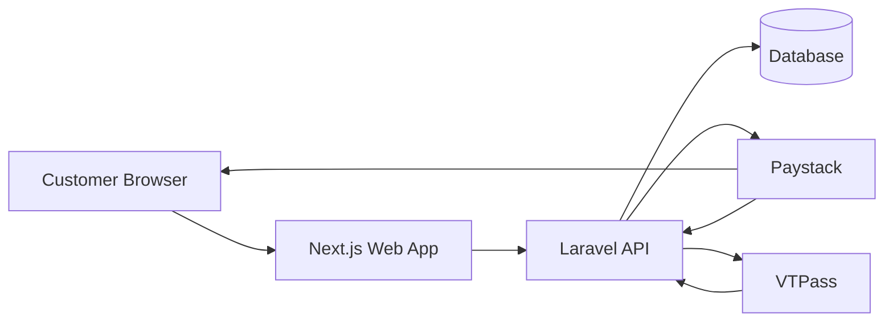
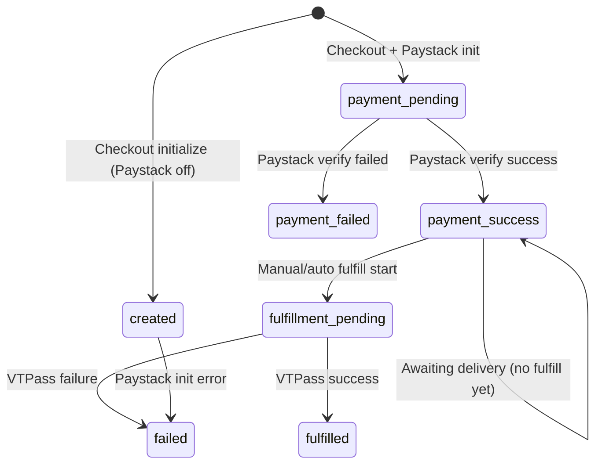
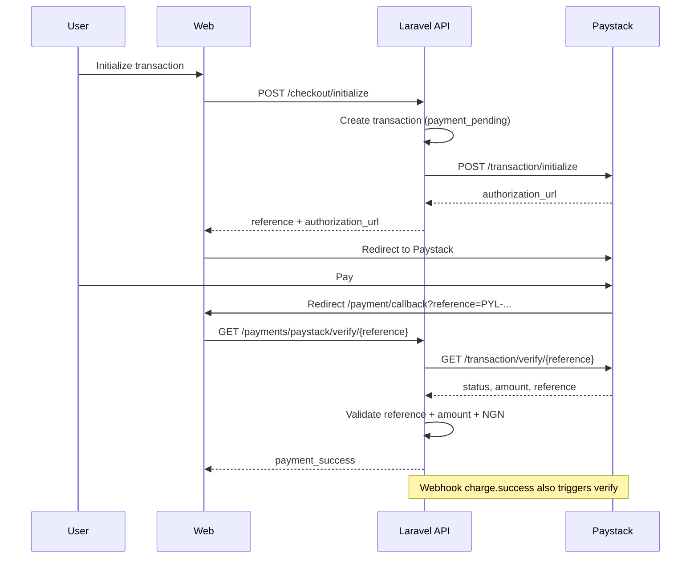
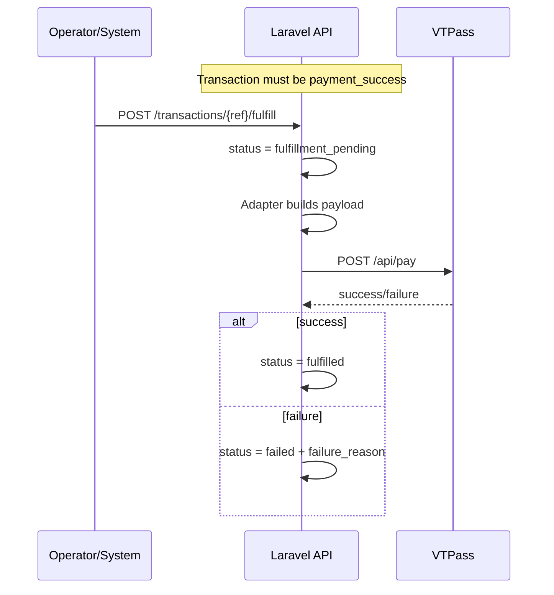

# PAYLITY NG — System Architecture

Practical architecture reference for engineers and operators.

---

## High-level architecture



**Monorepo layout**

| Path | Role |
|------|------|
| `apps/web` | Next.js 16 frontend (App Router, TypeScript, Tailwind) |
| `apps/api` | Laravel 12 API (PHP 8.2+) |
| `docs/` | Product and launch documentation |

---

## Frontend architecture

```
apps/web/src/
├── app/                    # Routes (/, /checkout, /payment/callback, /transaction/[ref])
├── components/
│   ├── checkout/           # Checkout engine UI
│   ├── payment/            # Payment callback client
│   ├── transaction/        # Status, receipt, timeline
│   └── system/             # Footer, build identity, about modal
├── hooks/                  # useCheckoutState
├── lib/
│   ├── api/                # API client, checkout, payments, transactions
│   ├── checkout/           # Pricing, validation, schemas
│   ├── system/             # buildInfo.ts
│   └── transaction/        # Display helpers
```

**Key behaviors**

- Checkout calls `POST /api/v1/checkout/initialize`
- Paystack redirect when `authorization_url` is returned
- Callback page calls `GET /api/v1/payments/paystack/verify/{reference}` — never trusts URL alone
- Transaction status page polls every 5s (max 2 min) while awaiting delivery
- Build identity from `NEXT_PUBLIC_*` env vars

---

## Backend architecture

```
apps/api/app/
├── Http/Controllers/Api/V1/
│   ├── CheckoutController.php
│   ├── PaystackController.php
│   ├── TransactionController.php
│   ├── FulfillmentController.php
│   └── HealthController.php
├── Services/
│   ├── TransactionService.php
│   ├── FeeService.php
│   ├── FraudService.php
│   ├── BuildInfoService.php
│   ├── Payments/
│   │   ├── PaystackService.php
│   │   └── PaymentVerificationService.php
│   └── Fulfillment/
│       ├── FulfillmentService.php
│       ├── VTPassService.php
│       └── Adapters/ (Airtime, Data, Electricity)
├── Models/Transaction.php
└── Support/ApiResponse.php
```

**API endpoints**

| Method | Path | Purpose |
|--------|------|---------|
| GET | `/api/v1/health` | Health + build info |
| POST | `/api/v1/checkout/initialize` | Create transaction + Paystack init |
| GET | `/api/v1/transactions/{reference}` | Transaction detail |
| POST | `/api/v1/transactions/{reference}/fulfill` | Manual VTPass fulfill |
| GET | `/api/v1/payments/paystack/verify/{reference}` | Verify payment |
| POST | `/api/v1/payments/paystack/webhook` | Paystack webhook |
| POST | `/api/v1/payments/paystack/callback` | Placeholder (no trust) |

**Money policy**

- Stored in DB as **naira integers**
- Sent to Paystack as **kobo** (`payable_amount × 100`)
- Guest limit: `product_amount` ≤ ₦10,000
- Convenience fee: ₦100 (v1 flat)

---

## Transaction lifecycle



---

## Paystack payment flow



**Rules**

- Callback URL visit does **not** confirm payment
- PAYLITY reference is used as Paystack reference
- Webhook validates `X-Paystack-Signature` (HMAC SHA512)

---

## VTPass fulfillment flow



**Adapters**

| Product | VTPass mapping |
|---------|----------------|
| Airtime | Network → serviceID (mtn, airtel, glo, etisalat) |
| Data | `{network}-data` + `variation_code` from `data_plan_id` |
| Electricity | Disco → serviceID + meter_number + meter_type |

**Safety defaults**

- `FEATURE_VTPASS=false` — fulfillment disabled
- `FEATURE_VTPASS_AUTO_FULFILL=false` — no auto-vend after payment

---

## Feature flags

| Flag | Default | Effect |
|------|---------|--------|
| `FEATURE_PAYSTACK` | `true` in example | Paystack init on checkout |
| `FEATURE_VTPASS` | `false` | Enables fulfill endpoint |
| `FEATURE_VTPASS_AUTO_FULFILL` | `false` | Auto-fulfill after payment verify |

Frontend flags are display-only via `NEXT_PUBLIC_ENVIRONMENT` (Sandbox vs Production label).

---

## CORS and auth

- **No user authentication** in MVP — all checkout is guest
- CORS configured for local dev (`localhost:3000` → API)
- Fulfill endpoint is **unauthenticated** — must be network-restricted or protected in production (IP allowlist, internal token — future PAY-013)

---

*Document: PAY-012 · System Architecture*
