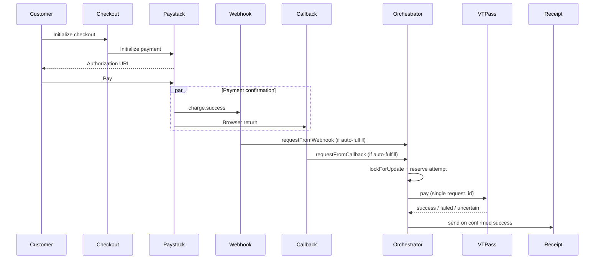

# Transaction Lifecycle

## Overview

PAYLITY completes checkout → Paystack payment → verification → VTPass fulfillment → receipt without changing customer UX. All fulfillment triggers converge on `ExactOnceFulfillmentService`.

## Lifecycle Diagram

## Trigger Sources

| Source | Entry point | Fulfillment path |
|--------|-------------|------------------|
| Webhook | `PaymentVerificationService::verify` | `ExactOnceFulfillmentService::requestFromWebhook` |
| Callback | `PaymentVerificationService::verify` | `ExactOnceFulfillmentService::requestFromCallback` |
| Scheduler | `paylity:process-fulfillment-retries` | `requestFromAutomaticRetry` |
| Payment reconciliation | `paylity:reconcile-payments` | `requestFromReconciliation` |
| Fulfillment reconciliation | `paylity:reconcile-fulfillments` | VTPass requery (no new purchase) |
| Operator fulfill | `POST /ops/transactions/{ref}/fulfill` | `requestFromOperator` |
| Operator retry | `POST /ops/transactions/{ref}/retry-fulfillment` | `requestFromManualRetry` |

## Locking Strategy

1. `DB::transaction` with `lockForUpdate()` on the transaction row
2. Refuse if already fulfilled, cancelled, manual review, or uncertain/submitted attempt exists
3. Create `fulfillment_attempts` record in `processing` **before** provider call
4. Execute VTPass outside the lock transaction after reservation commits
5. Database unique constraints: `request_id`, `successful_attempt_key` (one success per transaction)

## Invariants

- `fulfilled` ⇒ `payment_success`
- `fulfilled` ⇒ exactly one `succeeded` attempt
- `payment_failed` and `cancelled` never auto-fulfill
- Payment success is never downgraded by callback ordering
- Uncertain outcomes block new purchase until requery resolves original `request_id`
